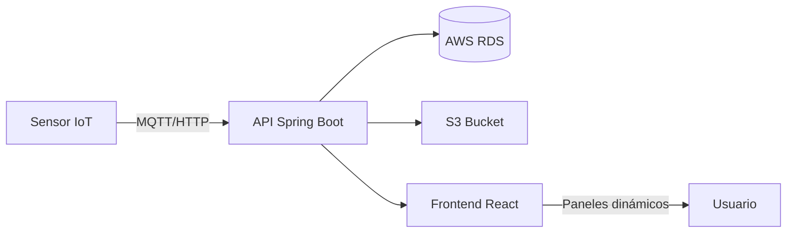
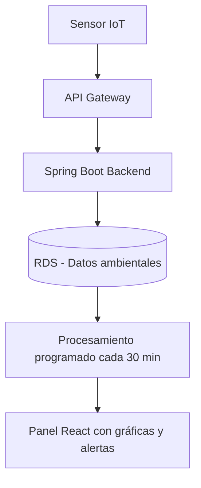
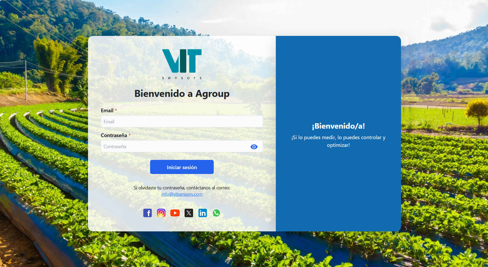
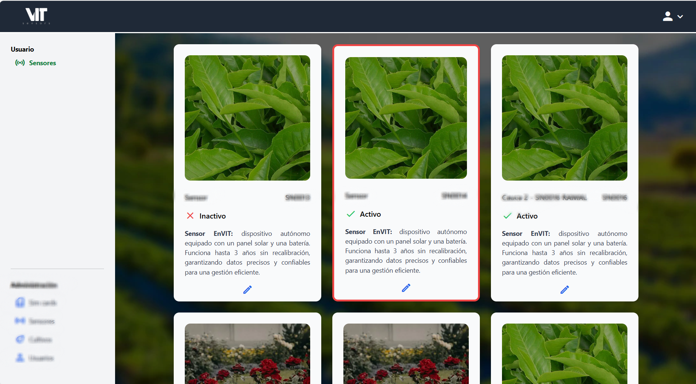
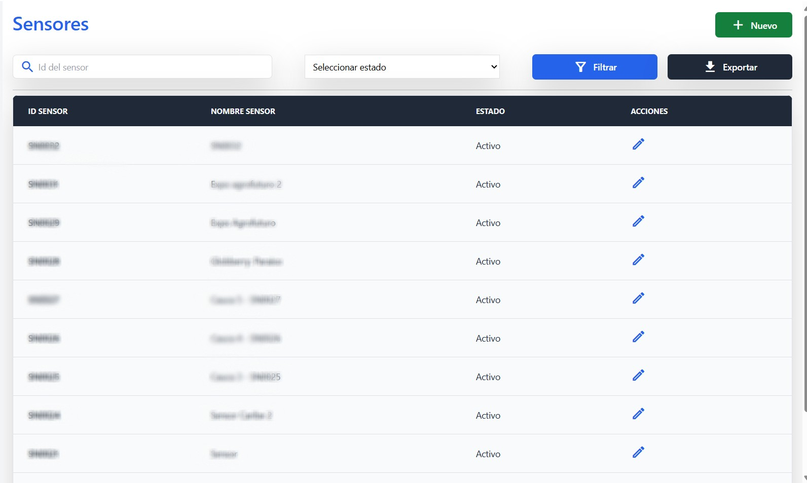
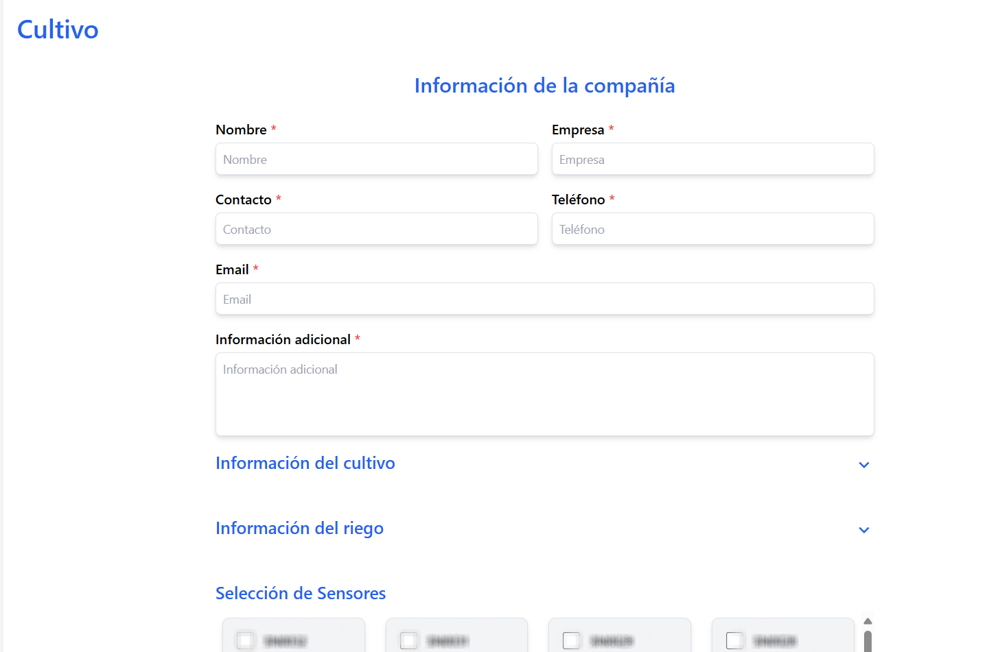

# 🌱 Agroup – Plataforma de Agricultura Inteligente

## 📖 Resumen
Plataforma orientada a la **digitalización del monitoreo agrícola** mediante sensores IoT que envían datos ambientales y geoespaciales en tiempo real.  
El sistema permite gestionar cultivos, usuarios y alertas automatizadas, además de visualizar las mediciones a través de paneles dinámicos e intuitivos.  

Inicié como **cofundador** y luego asumí el rol de **desarrollador principal**, liderando la arquitectura técnica, la infraestructura en la nube y las estrategias de optimización del rendimiento.

---

## 👤 Rol y Responsabilidades
- **Rol Principal:** Cofundador y Desarrollador Principal  
- **Funciones Clave:**
  - Liderazgo técnico y toma de decisiones estratégicas de arquitectura.  
  - Diseño, desarrollo y despliegue del backend y frontend.  
  - Configuración completa de la infraestructura en AWS.  
  - Mentoría técnica a practicantes y revisión de código.  

---

## 🛠️ Stack Tecnológico
- **Backend:** Spring Boot  
- **Frontend:** React (migrado de v16 → v19)  
- **Base de Datos:** AWS RDS (migración desde DynamoDB)  
- **Infraestructura:** AWS Elastic Beanstalk, Route 53, Amplify, S3, Nginx  
- **Servicios Adicionales:** Tareas programadas

---

## 🧭 Arquitectura del sistema

El siguiente diagrama ilustra el flujo de datos principal y los componentes dentro de la plataforma Agroup.

---

## 🚀 Funcionalidades Principales
- Recepción, almacenamiento y visualización de datos provenientes de sensores IoT.  
- Administración integral de sensores, usuarios, cultivos y simulaciones.  
- Generación de alertas automáticas por correo electrónico.  
- Registro de coordenadas GPS junto con mediciones ambientales.  
- Ejecución de tareas programadas (procesos y cálculos cada media hora).  

---

## 🏆 Logros Técnicos Destacados
- ⚡ **Optimización de rendimiento:** Reducción del tiempo de escritura de sensores de ~3 s a **300–400 ms** (−85 %).  
- ☁️ **Infraestructura eficiente:** Configuración de certificados SSL y despliegue en una **instancia pequeña sin balanceador de carga**, logrando un **ahorro del 15 % mensual** en infraestructura.  
- 🧩 **Migración de datos:** Rediseño del modelo relacional y migración del 70 % del backend desde DynamoDB (NoSQL) a RDS, mejorando consistencia y escalabilidad.  
- 🔔 **Automatización asincrónica:** Implementación de alertas automáticas y tareas recurrentes sin bloquear el flujo principal.  
- 🧱 **Modernización del frontend:** Actualización completa de React hasta la versión 19, garantizando compatibilidad y optimización del bundle.  
- 👨‍💻 **Liderazgo técnico:** Coordinación de esfuerzos del equipo, guía de practicantes y revisión de código.  

---

## ⚙️ Módulos y Flujos Destacados

### 1. Monitoreo Ambiental (Core del sistema)
- Captura continua de datos IoT: temperatura, humedad, iluminancia, etc.  
- Procesamiento programado cada 30 minutos con agregación de promedios y detección de anomalías.  
- Paneles dinámicos para análisis por fecha, variable y sensor.

#### 🔄 Flujo de Recolección y Procesamiento de Datos

### 2. Gestión de Cultivos

- Registro de parcelas, ubicación geográfica y tipo de cultivo.
- Cálculo de indicadores personalizados (ej. humedad promedio por cultivo).

### 3. Alertas Inteligentes

- Configuración de umbrales de alerta por variable y cultivo.
- Envío automático de notificaciones por correo electrónico.

---  

## 🌐 Vista General del Sistema

| Inicio de Sesión | Panel de Control |
|------------------|-------------------------------|
| { width="400" style="border-radius:8px;" } | { width="400" style="border-radius:8px;" } |

| Listado de Sensores | Configuración de Cultivos |
|----------------------|----------------|
| { width="400" style="border-radius:8px;" } | { width="400" style="border-radius:8px;" } |

---

## 📈 Impacto
- Plataforma estable, escalable y con infraestructura optimizada.  
- Reducción de costos operativos y de mantenimiento.  
- Mejora significativa del rendimiento general.  
- Incorporación ágil de nuevas funcionalidades sin comprometer la estabilidad.  
- Capacidad comprobada para escalar a múltiples usuarios y sensores simultáneamente.  
