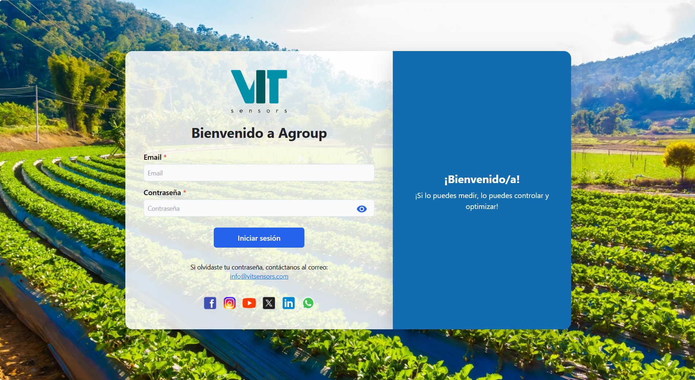
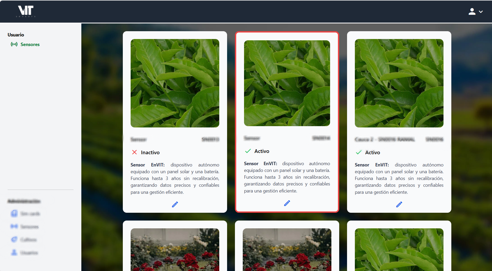

# 🌱 Agroup – Smart Agriculture Platform

## 📖 Overview
A platform focused on the **digitalization of agricultural monitoring** through IoT sensors that transmit environmental and geospatial data in real time.  
The system enables the management of crops, users, and automated alerts, while providing **dynamic and intuitive dashboards** for data visualization.  

I started as a **co-founder** and later took on the role of **lead developer**, responsible for the system’s technical architecture, cloud infrastructure, and performance optimization strategy.

---

## 👤 Role and Responsibilities
- **Main Role:** Co-founder & Lead Developer  
- **Key Contributions:**
  - Led technical decisions and architectural strategy.  
  - Designed, developed, and deployed backend and frontend components.  
  - Configured and managed the entire AWS-based infrastructure.  
  - Provided mentorship and code reviews for interns and junior developers.  

---

## 🛠️ Tech Stack
- **Backend:** Spring Boot  
- **Frontend:** React (migrated from v16 → v19)  
- **Database:** AWS RDS (migration from DynamoDB)  
- **Infrastructure:** AWS Elastic Beanstalk, Route 53, Amplify, S3  
- **Additional Services:** Scheduled tasks  

---

## 🧭 System Architecture

The following diagram illustrates the main data flow and components within the Agroup platform.

---

## 🚀 Core Features
- Real-time data ingestion, storage, and visualization from IoT sensors.  
- Full administration of sensors, users, crops, and simulation processes.  
- Automated email alerts and notifications.  
- GPS coordinate tracking alongside environmental metrics.  
- Scheduled background tasks for periodic calculations (every 30 minutes).  

---

## 🏆 Technical Achievements
- ⚡ **Performance Optimization:** Reduced sensor write time from ~3 s to **300–400 ms** (−85%).  
- ☁️ **Efficient Infrastructure:** Implemented SSL certificates and deployed on a **small single instance without a load balancer**, achieving **~15% monthly cost savings**.  
- 🧩 **Data Migration:** Redesigned the relational data model and migrated 70% of the backend from DynamoDB (NoSQL) to RDS, improving data consistency and scalability.  
- 🔔 **Asynchronous Automation:** Integrated background alerts and recurring tasks without blocking main execution flows.  
- 🧱 **Frontend Modernization:** Upgraded React from v16 to v19, ensuring compatibility and optimized bundling.  
- 👨‍💻 **Technical Leadership:** Coordinated development efforts, mentored team members, and performed strategic architectural reviews.  

---

## ⚙️ Featured Modules and Flows

### 1. Environmental Monitoring (Core of the system)
- Continuous IoT data capture: temperature, humidity, illuminance, etc.
- Processing scheduled every 30 minutes with average aggregation and anomaly detection.
- Dynamic dashboards for analysis by date, variable, and sensor.

#### 🔄 Data Collection and Processing Flow

### 2. Crop Management

- Record plots, geographic location, and crop type.
- Calculate custom indicators (e.g., average humidity per crop).

### 3. Smart Alerts

- Configure alert thresholds by variable and crop.
- Automatic email notifications.

---  

## 🌐 System Overview

| Login | Control Panel |
|------------------|-------------------------------|
| { width="400" style="border-radius:8px;" } | { width="400" style="border-radius:8px;" } |

| List of Sensors | Crop Settings |
|----------------------|----------------|
| { width="400" style="border-radius:8px;" } | { width="400" style="border-radius:8px;" } |

---

## 📈 Impact
- Delivered a stable, scalable, and cost-efficient cloud platform.  
- Reduced operational and maintenance costs.  
- Significantly improved system performance and responsiveness.  
- Enabled rapid integration of new features without compromising stability.  
- Scalable to handle multiple users and sensors simultaneously.  
