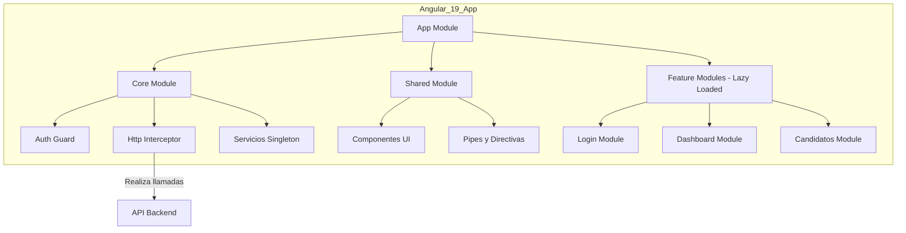
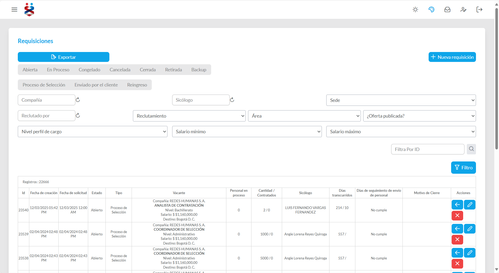
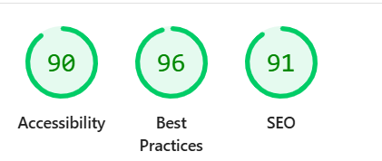
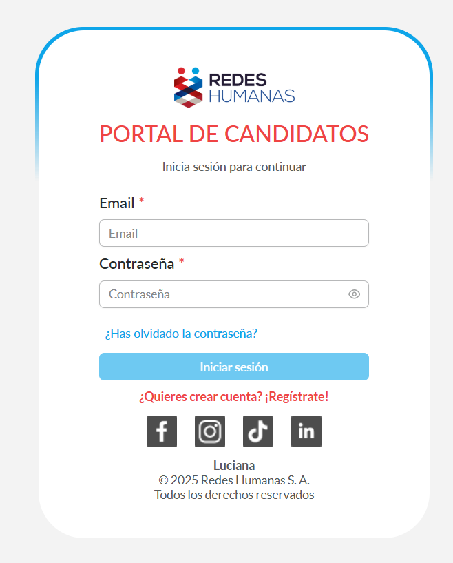
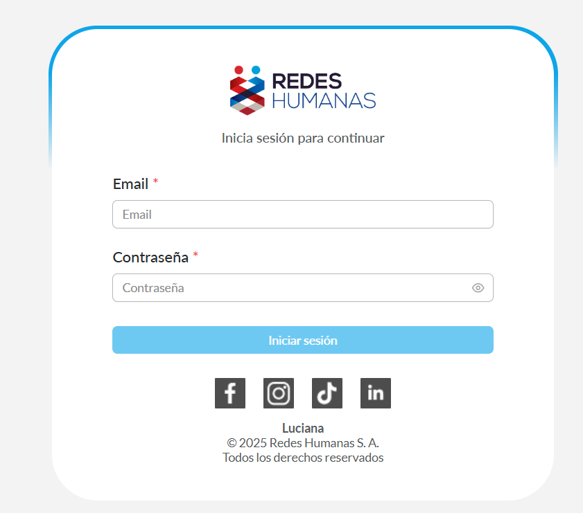
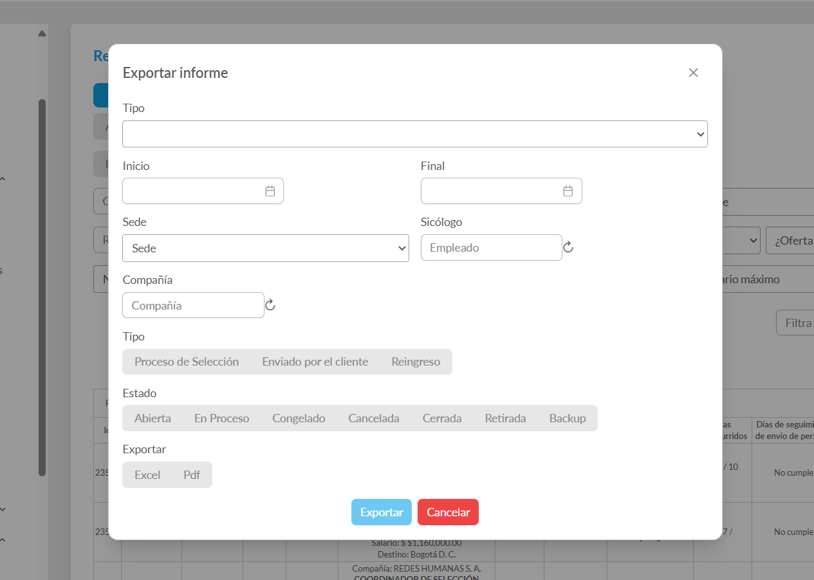
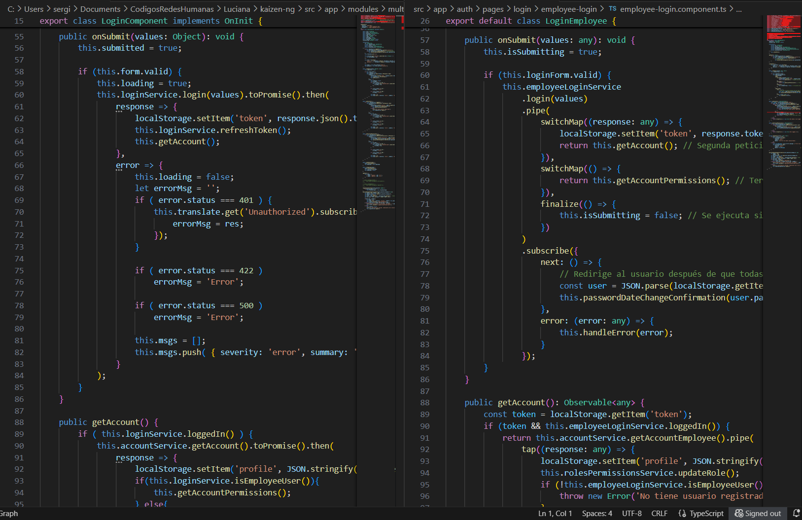

# 🚀 Modernización del Frontend: Migración de Angular v2 a v19

## 📖 Resumen y Contexto del Proyecto

Este documento detalla el proyecto de **modernización del frontend** para la plataforma **Luciana**, migrando una base de código heredada en **Angular v2** a una arquitectura moderna con **Angular 19**.

El frontend original, aunque funcional, presentaba desafíos que impactaban la velocidad de desarrollo, el rendimiento y la escalabilidad. Los principales problemas eran:

- **Deuda Técnica Acumulada:** Lógica de negocio compleja y fuertemente acoplada en los componentes.  
- **Rendimiento Deficiente:** Tiempos de carga lentos que afectaban la experiencia del usuario.  
- **Experiencia de Desarrollo (DX) Obsoleta:** Ecosistema de herramientas anticuado que ralentizaba la depuración y la innovación.  
- **Riesgos de Seguridad:** Dependencias desactualizadas y sin soporte oficial.  

El objetivo fue **ejecutar una reescritura estratégica** para sentar bases sólidas para el futuro de la plataforma.

---

## 🛠️ Tecnologías Clave

- **Lenguajes:** TypeScript, SCSS, HTML5  
- **Framework y Librerías:** Angular 19, RxJS, PrimeNG  
- **Arquitectura:** Modular, Carga Perezosa (Lazy Loading), Standalone Components  
- **Gestión de Estado:** Servicios Reactivos con RxJS (`BehaviorSubject`)  
- **Herramientas:** Angular CLI, Visual Studio Code, Git

---

## 🎯 Mi Rol y Responsabilidades

Como **Líder Técnico y Desarrollador Principal**, mis responsabilidades clave fueron:

1. 🏛️ **Diseño de Arquitectura y Planificación:**  
   Lideré la investigación y definición de la nueva arquitectura del frontend. Diseñé la hoja de ruta de migración, seleccioné herramientas y establecí las mejores prácticas para el equipo.

2. 🧪 **Prueba de Concepto (PoC):**  
   Desarrollé una PoC para validar la integración de la nueva aplicación (v19) con el backend existente, permitiendo una migración incremental sin afectar los servicios actuales.

3. 🏗️ **Desarrollo del Núcleo de la Aplicación:**  
   Implementé la estructura base, incluyendo módulos compartidos, servicios transversales (autenticación, gestión de estado con RxJS), interceptores HTTP y guardias de rutas.

4. 🚀 **Liderazgo en la Migración de Módulos:**  
   Guié y participé activamente en la reescritura de los primeros módulos clave, estableciendo un estándar de código y demostrando valor tangible desde las primeras etapas.

---

## 🏛️ Arquitectura Propuesta

Diseñé una arquitectura **modular y escalable**, centrada en el rendimiento y la mantenibilidad a largo plazo.

## 🔑 Principios Clave de la Arquitectura

- **Carga Perezosa (Lazy Loading):** Los módulos de funcionalidades solo se cargan bajo demanda, reduciendo drásticamente el tiempo de carga inicial y mejorando el *First Contentful Paint (FCP)*.  
- **Componentes Reutilizables:** Creación de una librería de componentes agnósticos en el `SharedModule` para mantener la consistencia visual (*look and feel*) y acelerar el desarrollo.  
- **Gestión de Estado Reactiva:** Uso de servicios con **RxJS (BehaviorSubject)** para manejar el estado como una fuente única de verdad, garantizando la consistencia de datos en toda la aplicación.  
- **Separación de Responsabilidades (SoC):** La lógica de negocio fue aislada en servicios, permitiendo que los componentes se centraran exclusivamente en la presentación y la interacción del usuario.  

---

## 🧠 Desafíos Técnicos y Soluciones

### 1. Planificación de una Migración sin Interrumpir el Negocio
**Desafío:** La aplicación era un monolito. Reescribirla por completo era inviable debido al riesgo y al tiempo requerido.  
**Solución:** Propuse una **estrategia de migración modular e incremental**. Identifiqué los módulos más críticos y aislados (Autenticación, Dashboard) para migrarlos primero. Esto permitió demostrar valor rápidamente y crear una base sólida sobre la cual construir, minimizando el riesgo.

---

### 2. Eliminación de Inconsistencias de Datos
**Desafío:** En la versión v2, los datos eran inconsistentes entre diferentes vistas, causando bugs y confusión al usuario.  
**Solución:** Implementé un **patrón de gestión de estado reactivo**. Creé servicios que actuaban como la única fuente de verdad (por ejemplo, `UsuarioService`).  
Los componentes se suscribían a *observables* de estos servicios. Cuando un dato cambiaba (por ejemplo, el perfil del usuario), todos los componentes suscritos se actualizaban automáticamente, garantizando la consistencia en tiempo real.

---

### 3. Optimización Radical del Rendimiento
**Desafío:** La plataforma antigua sufría de tiempos de carga de más de 10 segundos.  
**Solución:** Aproveché las optimizaciones nativas de **Angular 19**. La **compilación AOT (Ahead-of-Time)** y el **tree-shaking** redujeron el tamaño del paquete JavaScript inicial en aproximadamente un **80%**.  
Combinado con la **carga perezosa**, los módulos migrados cargaban de forma casi instantánea.

---

## 🏆 Logros y Resultados Clave

Aunque el proyecto global de migración se pausó por una decisión estratégica de la compañía, la fase que lideré fue un éxito rotundo y sentó las bases para el futuro.

✅ **Arquitectura Base Completada al 100%:**  
Se finalizó la estructura del nuevo proyecto, incluyendo un sistema de autenticación robusto, interceptores, guardias y módulos compartidos.  

🚀 **Módulos Críticos Migrados y Funcionales:**  
- Autenticación y Login  
- Dashboard Principal  
- Portal de Candidatos (Consulta y Gestión Documental)  
- Requisiciones  
- Operaciones  
- Contratos  

📊 **Mejoras de Rendimiento Cuantificables:**  
- Reducción del tiempo de carga inicial (*First Contentful Paint*) en un **~70%** en los módulos migrados.  
- Navegación entre vistas prácticamente instantánea, eliminando la fricción del usuario.  

💡 **Prueba de Concepto Validada:**  
El trabajo sirvió como una **PoC exitosa**, dejando una hoja de ruta clara y una base de código moderna lista para ser retomada.

---

## 🖼️ Galería de Mejoras Visuales y de Calidad

Esta galería muestra el impacto multifacético del proyecto, enfocándose en la experiencia de usuario y la calidad del código.

| Maqueta de la Nueva UI (Conceptual) | Calidad y Buenas Prácticas (Lighthouse) |
|------------------------------------|------------------------------------------|
| { width="350" style="border-radius:10px; box-shadow:0 2px 6px rgba(0,0,0,0.2);" } | { width="350" style="border-radius:10px; box-shadow:0 2px 6px rgba(0,0,0,0.2);" } |
| **Librería de Componentes (PrimeNG)** | **Refactorización de Código** |
| { width="160" style="border-radius:8px;" } { width="160" style="border-radius:8px;" } { width="160" style="border-radius:8px;" } { width="160" style="border-radius:8px;" } | { width="350" style="border-radius:10px; box-shadow:0 2px 6px rgba(0,0,0,0.2);" } |

---

## 💡 Reflexión y Aprendizajes

Este proyecto fue un desafío de gran envergadura que consolidó mis habilidades en **arquitectura de software frontend**, **planificación estratégica** y **liderazgo técnico**.  
Aprendí a gestionar la complejidad de modernizar sistemas heredados, a tomar decisiones críticas sobre el stack tecnológico y a demostrar el valor de la inversión en tecnología a través de resultados medibles.  

La base que construimos dejó a la plataforma en una posición mucho más fuerte para su futura evolución.
