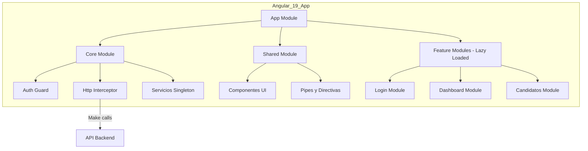

# 🚀 Frontend Modernization: Migration from Angular v2 to v19

## 📖 Project Overview and Context

This document outlines the **frontend modernization project** for the **Luciana** platform, migrating a legacy **Angular v2** codebase to a modern **Angular 19** architecture.

The original frontend, although functional, presented challenges that affected development speed, performance, and scalability. The main issues were:

- **Accumulated Technical Debt:** Complex business logic tightly coupled within components.  
- **Poor Performance:** Slow load times that negatively impacted user experience.  
- **Outdated Developer Experience (DX):** An obsolete toolchain that slowed debugging and innovation.  
- **Security Risks:** Outdated dependencies with no official support.  

The goal was to **execute a strategic rewrite** to establish a strong foundation for the platform’s future.

---

## 🛠️ Key Technologies

- **Languages:** TypeScript, SCSS, HTML5  
- **Framework and Libraries:** Angular 19, RxJS, PrimeNG  
- **Architecture:** Modular, Lazy Loading, Standalone Components  
- **State Management:** Reactive Services with RxJS (`BehaviorSubject`)  
- **Tools:** Angular CLI, Visual Studio Code, Git  

---

## 🎯 My Role and Responsibilities

As **Technical Lead and Principal Developer**, my main responsibilities included:

1. 🏛️ **Architecture Design and Planning:**  
   Led research and definition of the new frontend architecture. Designed the migration roadmap, selected tools, and established best practices for the development team.

2. 🧪 **Proof of Concept (PoC):**  
   Developed a PoC to validate integration of the new (v19) application with the existing backend, enabling incremental migration without service interruption.

3. 🏗️ **Core Application Development:**  
   Implemented the foundational structure, including shared modules, cross-cutting services (authentication, state management with RxJS), HTTP interceptors, and route guards.

4. 🚀 **Module Migration Leadership:**  
   Guided and actively participated in rewriting key initial modules, setting a coding standard and demonstrating tangible value early in the process.

---

## 🏛️ Proposed Architecture

A **modular and scalable** architecture designed for long-term performance and maintainability.

---

## 🔑 Core Architectural Principles

- **Lazy Loading:** Feature modules load on demand, dramatically reducing initial load time and improving *First Contentful Paint (FCP)*.  
- **Reusable Components:** A library of agnostic components was built within the `SharedModule` to maintain visual consistency and accelerate development.  
- **Reactive State Management:** Used **RxJS (BehaviorSubject)** services as a single source of truth, ensuring consistent data across the entire application.  
- **Separation of Concerns (SoC):** Business logic was isolated in services, allowing components to focus solely on presentation and user interaction.  

---

## 🧠 Technical Challenges and Solutions

### 1. Planning a Migration Without Business Disruption
**Challenge:** The application was monolithic. A full rewrite was unfeasible due to risk and time constraints.  
**Solution:** Proposed a **modular and incremental migration strategy**. Identified the most critical and isolated modules (Authentication, Dashboard) to migrate first.  
This approach demonstrated value early and built a stable foundation for continued modernization.

---

### 2. Eliminating Data Inconsistencies
**Challenge:** In v2, data inconsistencies between views caused bugs and user confusion.  
**Solution:** Implemented a **reactive state management pattern**. Created services acting as the single source of truth (e.g., `UserService`).  
Components subscribed to these services’ observables. When data changed (e.g., user profile), all subscribed components automatically updated, ensuring real-time consistency.

---

### 3. Radical Performance Optimization
**Challenge:** The legacy platform suffered load times exceeding 10 seconds.  
**Solution:** Leveraged **Angular 19’s** native optimizations. **AOT (Ahead-of-Time) compilation** and **tree-shaking** reduced the initial JavaScript bundle size by approximately **80%**.  
Combined with **lazy loading**, migrated modules loaded almost instantly.

---

## 🏆 Key Achievements and Results

Although the full migration project was paused due to a strategic company decision, the phase I led was a complete success and laid a strong foundation for the platform’s future.

✅ **Base Architecture Completed (100%)**  
The new project structure was finalized, including a robust authentication system, interceptors, guards, and shared modules.  

🚀 **Critical Modules Migrated and Fully Functional:**  
- Authentication and Login  
- Main Dashboard  
- Candidate Portal (Document Management and Queries)  
- Requisitions  
- Operations  
- Contracts  

📊 **Quantifiable Performance Improvements:**  
- Initial load time (*First Contentful Paint*) reduced by **~70%** on migrated modules.  
- View-to-view navigation became nearly instantaneous, eliminating user friction.  

💡 **Validated Proof of Concept:**  
This work served as a **successful PoC**, leaving a clear roadmap and a modern, ready-to-continue codebase.

---

## 🖼️ Visual and Quality Improvements Gallery

This gallery highlights the multifaceted impact of the project, focusing on user experience and code quality.

| New UI Mockup (Conceptual) | Quality & Best Practices (Lighthouse) |
|------------------------------------|------------------------------------------|
| { width="350" style="border-radius:10px; box-shadow:0 2px 6px rgba(0,0,0,0.2);" } | { width="350" style="border-radius:10px; box-shadow:0 2px 6px rgba(0,0,0,0.2);" } |
| **Component Library (PrimeNG)** | **Code Refactoring** |
| { width="160" style="border-radius:8px;" } { width="160" style="border-radius:8px;" } { width="160" style="border-radius:8px;" } { width="160" style="border-radius:8px;" } | { width="500" style="border-radius:10px; box-shadow:0 2px 6px rgba(0,0,0,0.2);" } |

---

## 💡 Reflection and Lessons Learned

This project was a major challenge that strengthened my expertise in **frontend software architecture**, **strategic planning**, and **technical leadership**.  
I learned to manage the complexity of modernizing legacy systems, make critical technology stack decisions, and demonstrate the value of tech investment through measurable outcomes.  

The foundation we built positioned the platform for a much stronger and more sustainable future.
