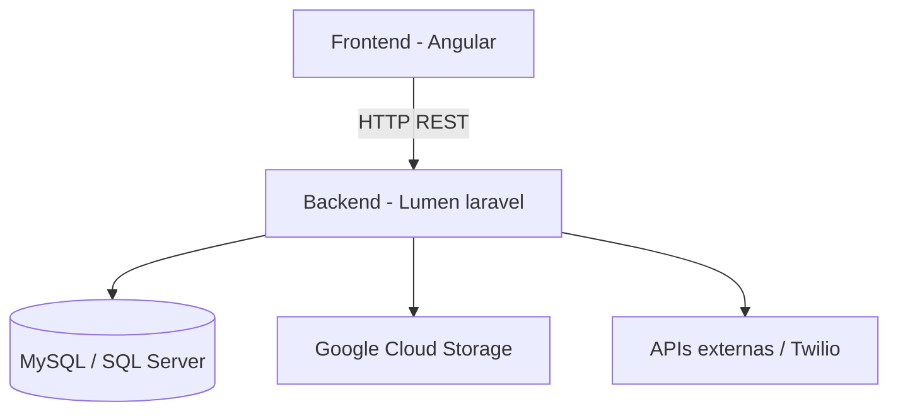
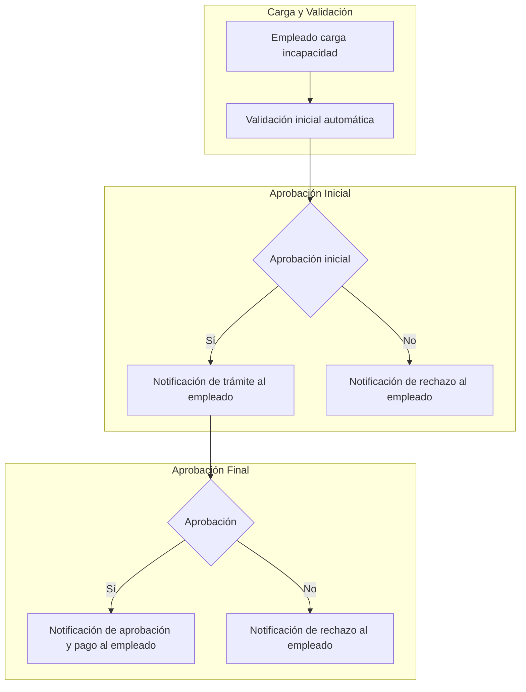

# 💼 Luciana – Plataforma de Gestión de Recursos Humanos

## 📖 Resumen y Contexto
Luciana fue una plataforma **integral de contratación y recursos humanos** con alcance **multiusuario (B2C y B2B)**. Se utilizaba tanto por áreas internas (selección, médica, contabilidad, soporte) como por **usuarios externos** (candidatos y compañías aliadas). El sistema centralizaba la información de empleados, automatizaba procesos de contratación y generaba documentos, reportes y notificaciones.

Mi rol fue de **desarrollador Full-stack**, participando activamente en mantenimiento, desarrollo de nuevas funcionalidades y toma de decisiones técnicas. Además, asumí la **coordinación técnica informal**, apoyando a otros desarrolladores, revisando código y resolviendo incidencias críticas.

---

## 👤 Rol y Contribución
- **Rol Principal:** Desarrollador Full-stack (Backend y Frontend)
- **Contribución Adicional:** Coordinación técnica, revisión de código y soporte al equipo de desarrollo

---

## 🛠️ Stack Tecnológico
- **Backend:** Lumen Laravel 5.4 (producción) / Lumen Laravel 11 (migración)
- **Frontend:** Angular v2 (legacy) / Angular 19 (migración parcial)
- **Base de Datos:** MySQL y SQL Server
- **Infraestructura:** Google Cloud Platform (GCP) e instancias locales
- **Integraciones:** APIs externas y Twilio (notificaciones WhatsApp)

---

## 🧭 Arquitectura del sistema

El siguiente diagrama ilustra el flujo de datos principal y los componentes dentro de la plataforma Luciana.

### 🖥️ Interfaces de Inicio de Sesión

| Portal de Candidatos | Portal de Empleados |
|------------------|-----------------|
| { width="400" style="border-radius:8px;" } | { width="400" style="border-radius:8px;" } |

---

## 🚀 Funcionalidades Principales Desarrolladas
- **Portal de Autoservicio para Candidatos:** Registro, postulación a ofertas, carga de documentos y gestión de incapacidades.
- **Portal para Empresas Terceras:** Consulta de información de empleados tercerizados.
- **Integración Automática de Datos y Documentos:** Sincronización entre portales internos y externos.
- **Notificaciones Multicanal:** Automatización de envíos por correo y WhatsApp.
- **Generación Dinámica de Documentos:** Contratos, anexos y carnés personalizados según empresa o cargo.
- **Módulos de Salud Ocupacional:** Gestión de incapacidades, casos médicos y exámenes ocupacionales.
- **Reportes en Tiempo Real:** Auditoría y control interno.
- **Procesos Masivos:** Carga y generación masiva de datos desde Excel.

---

## 🏆 Logros Técnicos y Desafíos

### ⚡ Optimización de Rendimiento
- Migré la lógica ineficiente de *ApiHandler* a consultas optimizadas con el ORM de Laravel.  
  → **Resultado:** Reducción del tiempo de respuesta de **15 s a 2–3 s** y del tamaño de los resultados de **10 MB a 1.2 MB**.  
  → **Impacto:** Estabilidad del servidor y habilitación del trabajo remoto sin interrupciones.

### ☁️ Arquitectura Híbrida de Almacenamiento
- Diseñé e implementé un sistema híbrido de almacenamiento (instancia + Google Cloud Storage), migrando **1 TB de archivos** sin pérdida de datos.  
  → **Impacto:** **Reducción del 15–20 % en costos de infraestructura** y aumento en escalabilidad y seguridad.

### 🧱 Migración de Frontend (Angular v2 → v19)
- Planifiqué y comencé la reescritura completa del frontend. Logré establecer la arquitectura base y migrar con éxito varios módulos clave, demostrando la viabilidad del proyecto y los beneficios inmediatos en rendimiento y experiencia de desarrollo.

[➡️ **Ver detalles técnicos del proyecto de migración aquí**](./luciana-front.es.md)

**Nota:** Aunque la migración completa fue pausada posteriormente debido a una re-priorización estratégica de la compañía, la fase inicial que lideré sirvió como una prueba de concepto robusta, sentando las bases técnicas y demostrando el camino a seguir para la futura modernización de la plataforma.

### 💡 Migración de Backend (Lumen 5.4 → 11)
- Desarrollé la prueba de concepto para validar la migración del backend, asegurando compatibilidad total con Angular 19.
    
---

## ⚙️ Módulos y Automatizaciones Destacadas

### 1. Onboarding y Gestión Documental (B2C)
- Diseño del portal de autoservicio para candidatos, desde registro hasta carga documental.  
- Los documentos se reutilizaban automáticamente en distintos procesos, eliminando duplicidad.  
- Creé la lógica de **transferencia de datos y documentos** entre operaciones, aumentando la eficiencia del equipo en **25 %**.

#### 🔄 Flujo de Onboarding

### 2. Eficiencia y Procesos Masivos
- **Carga Masiva desde Excel:** Registro automático de miles de candidatos por lote.  
- **Generación Masiva de Documentos:** Descarga simultánea en PDF según filtros (empresa, cargo, tipo de documento).

### 3. Salud Ocupacional y Cumplimiento
- **Módulo de Incapacidades:** Formulario dinámico con gestión de estados, validaciones y notificaciones automáticas.  
- **Módulo de Exámenes Médicos:** Presupuestos, agendas, plantillas automáticas y notificaciones por correo/WhatsApp.  
- **Casos Médicos Críticos:** Registro de incidentes HSE con trazabilidad completa.

#### 🩺 Flujo del Módulo de Incapacidades

### 4. Control Interno y Auditoría
- **Reportes Dinámicos:** Reemplazo del BI semanal por reportes en tiempo real.  
- **Sistemas de Ticketing Interno::** Implementé dos sistemas de gestión de solicitudes: uno para requerimientos de desarrollo (bugs, features) y otro para soporte de TI (impresoras, contraseñas), mejorando la organización del trabajo.
- **Módulo de Inventario de Activos:** Diseñé un sistema para registrar y controlar los equipos de la compañía (seriales, historial de usuarios, fechas), optimizando la planificación de compras.

---

## 📈 Impacto Cuantificable
- **Reducción de Costos:** Eliminación de proveedores externos para gestión médica.  
- **Ahorro de Tiempo:** Reducción del **20–50 %** en tareas operativas clave.  
- **Estabilidad Operacional:** Eliminación de saturaciones del servidor.  
- **Control Financiero:** Seguimiento automatizado de costos por laboratorio médico.

---

## 🌐 Vista General del Sistema

| Módulo Contratos | Programación exámenes médicos |
|------------------|-------------------------------|
| { width="400" style="border-radius:8px;" } | { width="400" style="border-radius:8px;" } |

| Portal de Candidatos | Incapacidades |
|----------------------|----------------|
| { width="400" style="border-radius:8px;" } | { width="400" style="border-radius:8px;" } |

---

## 🔍 Reflexión Personal
Luciana representó un reto integral: un sistema extenso, con múltiples dependencias y una base de código heredada. A través de mi participación, pude **mejorar la estabilidad, escalabilidad y usabilidad del sistema**, liderando la evolución técnica y consolidando mi experiencia en **arquitectura híbrida, optimización de rendimiento y liderazgo técnico**.

---
