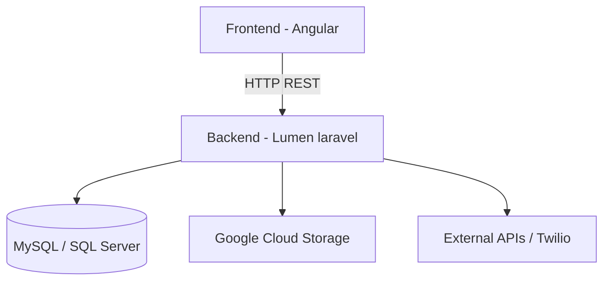
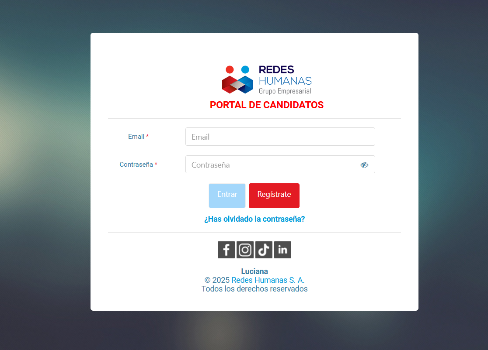
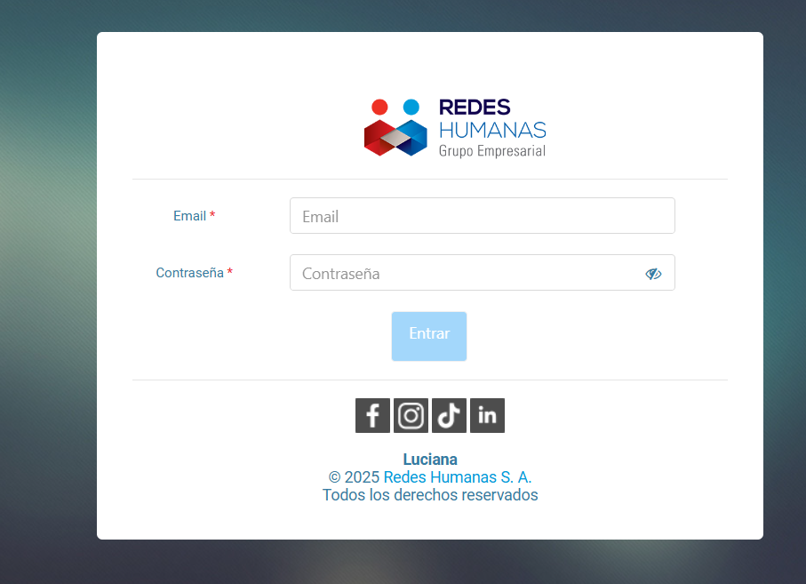
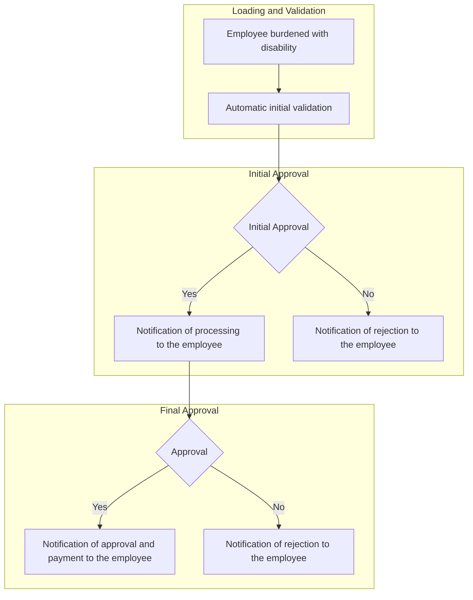
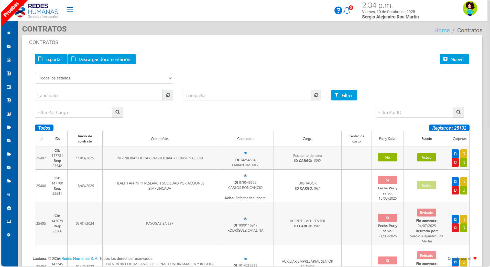
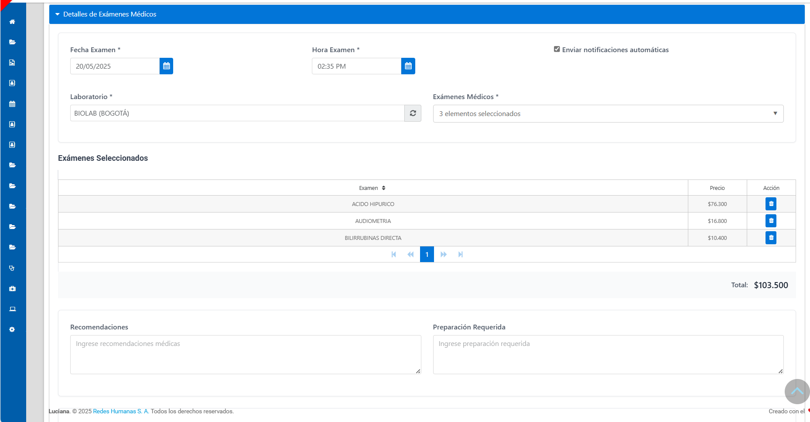
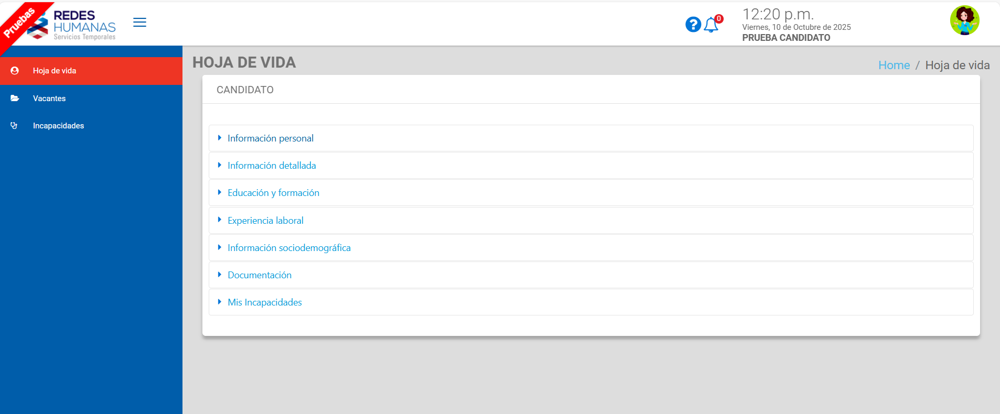
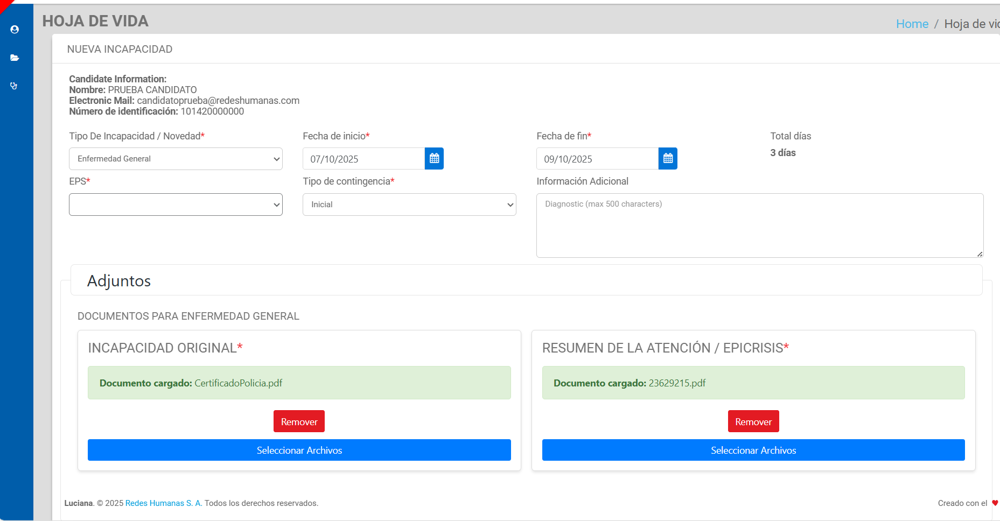

# 💼 Luciana – Human Resources Management Platform

## 📖 Overview and Context
Luciana was a **comprehensive HR and recruitment platform** with **multi-user access (B2C and B2B)**. It was used by internal teams (recruitment, medical, accounting, support) and **external users** (candidates and partner companies).  
The system centralized employee data, automated hiring processes, and generated documents, reports, and notifications.

My role was as a **Full-stack Developer**, actively contributing to maintenance, new feature development, and technical decision-making.  
I also took on **informal technical coordination**, supporting other developers, conducting code reviews, and resolving critical incidents.

---

## 👤 Role and Contribution
- **Main Role:** Full-stack Developer (Backend & Frontend)  
- **Additional Contributions:** Technical coordination, code reviews, and developer support  

---

## 🛠️ Tech Stack
- **Backend:** Lumen Laravel 5.4 (production) / Lumen Laravel 11 (migration)  
- **Frontend:** Angular v2 (legacy) / Angular 19 (partial migration)  
- **Database:** MySQL and SQL Server  
- **Infrastructure:** Google Cloud Platform (GCP) and on-premise instances  
- **Integrations:** External APIs and Twilio (WhatsApp notifications)  

---

## 🧭 System Architecture

The following diagram illustrates the main data flow and components within the Luciana platform.

### 🖥️ Login Interfaces 

| Candidate Portal | Employee Portal |
|------------------|-----------------|
| { width="400" style="border-radius:8px;" } | { width="400" style="border-radius:8px;" } |

---

## 🚀 Main Features Developed
- **Candidate Self-service Portal:** Registration, job application, document upload, and leave management.  
- **Third-party Company Portal:** Employee information dashboard for partner companies.  
- **Automated Data and Document Sync:** Seamless synchronization between internal and external portals.  
- **Multichannel Notifications:** Automated email and WhatsApp alerts.  
- **Dynamic Document Generation:** Automatic creation of contracts, attachments, and ID cards by company or role.  
- **Occupational Health Modules:** Management of sick leaves, medical cases, and occupational exams.  
- **Real-time Reporting:** Internal control and auditing dashboards.  
- **Mass Processes:** Bulk data and document generation from Excel.  

---

## 🏆 Technical Achievements and Challenges

### ⚡ Performance Optimization
- Refactored inefficient logic from *ApiHandler* to optimized ORM queries using Laravel.  
  → **Result:** Response times reduced from **15 s to 2–3 s**, payload size reduced from **10 MB to 1.2 MB**.  
  → **Impact:** Improved server stability and enabled uninterrupted remote work.

### ☁️ Hybrid Storage Architecture
- Designed and implemented a hybrid storage system (local instance + Google Cloud Storage), migrating **1 TB of files** without data loss.  
  → **Impact:** **15–20 % reduction in infrastructure costs** and improved scalability and security.

### 🧱 Frontend Migration (Angular v2 → v19)
- Planned and initiated the full frontend rewrite, establishing the core architecture and successfully migrating several key modules.  
  → Demonstrated the project’s feasibility and immediate benefits in performance and developer experience.  

[➡️ **See technical details of the migration project here**](./luciana-front.md)

**Note:** The full migration was later paused due to a company reprioritization, but the initial phase I led provided a strong proof of concept and technical foundation for future modernization.

### 💡 Backend Migration (Lumen 5.4 → 11)
- Developed a proof of concept to validate backend migration ensuring full compatibility with Angular 19.

---

## ⚙️ Key Modules and Automations

### 1. Onboarding and Document Management (B2C)
- Designed the candidate self-service portal, from registration to document submission.  
- Implemented automatic document reuse across processes, eliminating redundancy.  
- Created **data and document transfer logic** between operations, increasing team efficiency by **25 %**.

#### 🔄 Onboarding Flow

### 2. Efficiency and Bulk Processing
- **Excel Batch Upload:** Automated registration of thousands of candidates in bulk.  
- **Mass Document Generation:** Simultaneous PDF downloads filtered by company, position, or document type.

### 3. Occupational Health and Compliance
- **Sick Leave Module:** Dynamic form system with validation and automated notifications.  
- **Medical Exam Module:** Budgeting, scheduling, automatic templates, and multichannel notifications.  
- **Critical Medical Cases:** Full traceability of workplace health and safety incidents (HSE).

#### 🩺 Disabilities Module Flow

### 4. Internal Control and Auditing
- **Dynamic Reports:** Replaced weekly BI reports with real-time dashboards.  
- **Internal Ticketing Systems:** Implemented two management systems — one for development requests (bugs, features) and one for IT support (printers, passwords), improving team workflow.  
- **Asset Inventory Module:** Designed a system to manage company equipment (serials, user history, dates), optimizing purchasing planning.

---

## 📈 Quantifiable Impact
- **Cost Reduction:** Eliminated the need for external medical management providers.  
- **Time Savings:** Decreased operational workload by **20–50 %** in key tasks.  
- **Operational Stability:** Removed server overload issues.  
- **Financial Control:** Automated tracking of medical lab costs.

---

## 🌐 System Overview

| Contracts Module | Scheduling medical examinations |
|------------------|-------------------------------|
| { width="400" style="border-radius:8px;" } | { width="400" style="border-radius:8px;" } |

| Candidate Portal | Disabilities |
|----------------------|----------------|
| { width="400" style="border-radius:8px;" } | { width="400" style="border-radius:8px;" } |

---

## 🔍 Personal Reflection
Luciana represented a large-scale, multi-layered challenge with a complex legacy codebase. Through my involvement, I improved the **system’s stability, scalability, and usability**, leading the technical evolution and strengthening my expertise in **hybrid architectures, performance optimization, and technical leadership**.

---
