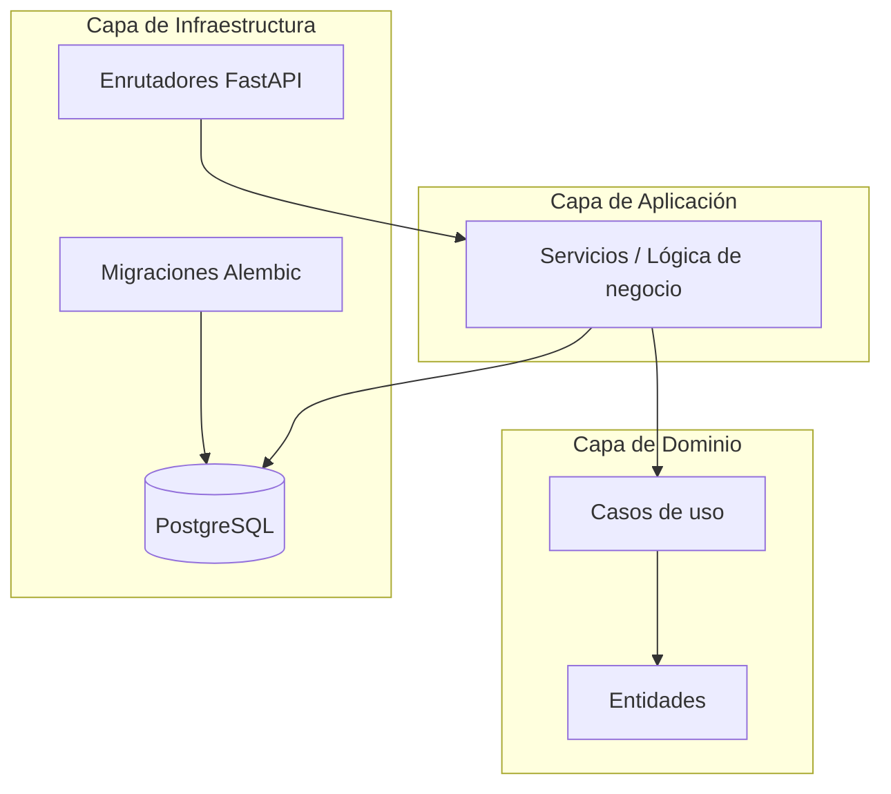

# 💼 Sistema de Nómina – API para Gestión de Empresas Pequeñas

## 📖 Resumen y Contexto
El proyecto consistió en el desarrollo de una **API desde cero para la gestión y pago de nóminas** de pequeñas empresas. El objetivo era construir una solución modular, escalable y moderna, capaz de adaptarse a diferentes estructuras empresariales y requerimientos legales.

Durante mi participación, contribuí en el **diseño inicial de la base de datos**, aprovechando mis conocimientos en contabilidad, y colaboré en la definición de la **arquitectura base del sistema**, orientada bajo principios de **Arquitectura Hexagonal** y **Vertical Slice**, implementada con **FastAPI (Python)**.

---

## 👤 Rol y Contribución
- **Rol Principal:** Desarrollador Backend
- **Aportes Clave:**
  - Diseño del esquema de base de datos inicial para el módulo de nómina.
  - Implementación de endpoints CRUD para **compañías** y **perfiles de cargo**.
  - Colaboración en la definición de la arquitectura del sistema junto a otro desarrollador.
  - Revisión y adaptación de la estructura del proyecto para cumplir con principios de **independencia de capas** y **escalabilidad**.

---

## 🛠️ Stack Tecnológico
- **Lenguaje:** Python 3
- **Framework:** FastAPI
- **Base de Datos:** PostgreSQL
- **Arquitectura:** Hexagonal + Vertical Slice
- **ORM:** SQLAlchemy
- **Otros:** Pydantic, Alembic (migraciones), Uvicorn

---


## 🧭 Arquitectura del sistema
El siguiente diagrama ilustra la estructura general de la API, destacando su diseño modular y el flujo de datos basado en la Arquitectura Hexagonal.



---

## 📡 Ejemplo de Endpoint Implementado
```python
@router.post("/", response_model=CompanyOut)
async def create_company(company_data: CreateCompanyRequest, use_case: CompanyUseCases = Depends(get_company_use_cases)):
    return use_case.create_company(company_data)
```
    
---

## 🚀 Logros y Aprendizajes
- Participé en el diseño de la base del sistema, asegurando que fuera compatible con requerimientos contables y escalable para futuras integraciones.
- Asimilé rápidamente el stack de FastAPI y sus conceptos modernos (dependency injection, routers, Pydantic schemas).
- Implementé los primeros módulos funcionales (compañías y perfiles de cargo), sirviendo de referencia para la expansión posterior del sistema.
- Profundicé en patrones de diseño aplicados a arquitectura hexagonal y separación de responsabilidades.

---

## 🧭 Reflexión Personal
Este proyecto representó un **reto técnico y de adaptación**: implicó trabajar con un framework nuevo y aplicar conceptos arquitectónicos avanzados mientras se construía una base sólida para un producto real. La experiencia reforzó mi capacidad para **aprender rápidamente tecnologías nuevas**, **colaborar en diseño de arquitecturas limpias** y **alinear el desarrollo con principios contables y de negocio**.

---
