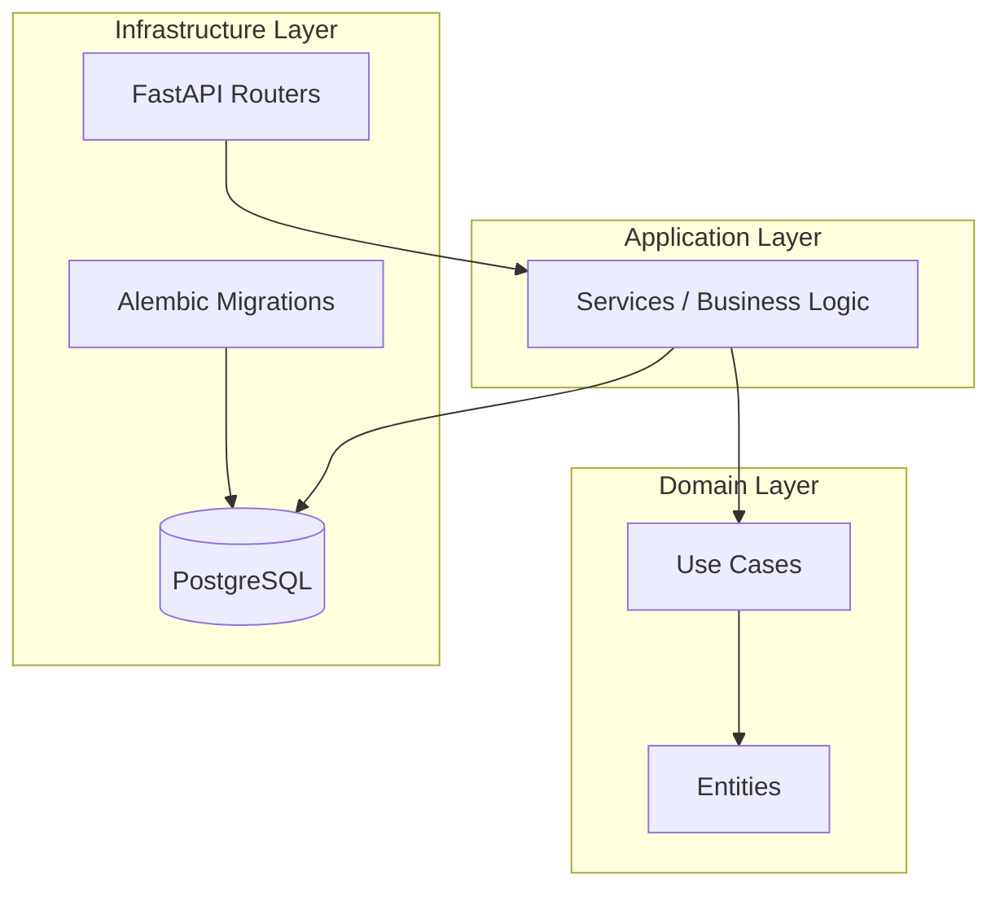

# 💼 Payroll System – API for Small Business Management

## 📖 Overview and Context
The project involved developing a **payroll management API from scratch** for small businesses. The goal was to build a **modular, scalable, and modern solution** capable of adapting to different business structures and legal requirements.

During my participation, I contributed to the **initial database design**, leveraging my accounting background, and collaborated on defining the **core system architecture**, based on **Hexagonal Architecture** and **Vertical Slice** principles, implemented using **FastAPI (Python)**.

---

## 👤 Role and Contribution
- **Main Role:** Backend Developer  
- **Key Contributions:**
  - Designed the initial database schema for the payroll module.  
  - Implemented CRUD endpoints for **companies** and **job profiles**.  
  - Collaborated with another developer to define the system’s architecture.  
  - Reviewed and structured the project to ensure **layer independence** and **scalability**.

---

## 🛠️ Tech Stack
- **Language:** Python 3  
- **Framework:** FastAPI  
- **Database:** PostgreSQL  
- **Architecture:** Hexagonal + Vertical Slice  
- **ORM:** SQLAlchemy  
- **Other Tools:** Pydantic, Alembic (migrations), Uvicorn  

---

## 🧭 System Architecture
The following diagram illustrates the overall structure of the API, highlighting its modular design and data flow based on Hexagonal Architecture.



---

## 📡 Example of Implemented Endpoint

```python
@router.post("/", response_model=CompanyOut)
async def create_company(company_data: CreateCompanyRequest, use_case: CompanyUseCases = Depends(get_company_use_cases)):
    return use_case.create_company(company_data)
```

---

## 🚀 Achievements and Learnings
- Contributed to the foundation of the system, ensuring compliance with accounting requirements and scalability for future integrations.  
- Quickly mastered the FastAPI stack and its modern concepts (dependency injection, routers, Pydantic schemas).  
- Implemented the first functional modules (companies and job profiles), serving as a reference for future development.  
- Deepened my understanding of **design patterns**, **hexagonal architecture**, and **separation of concerns**.

---

## 🧭 Personal Reflection
This project was a **technical and adaptive challenge** — it required learning a new framework and applying advanced architectural concepts while laying the groundwork for a real-world product.  
The experience strengthened my ability to **quickly learn new technologies**, **collaborate on clean architectural designs**, and **align software development with accounting and business principles**.
